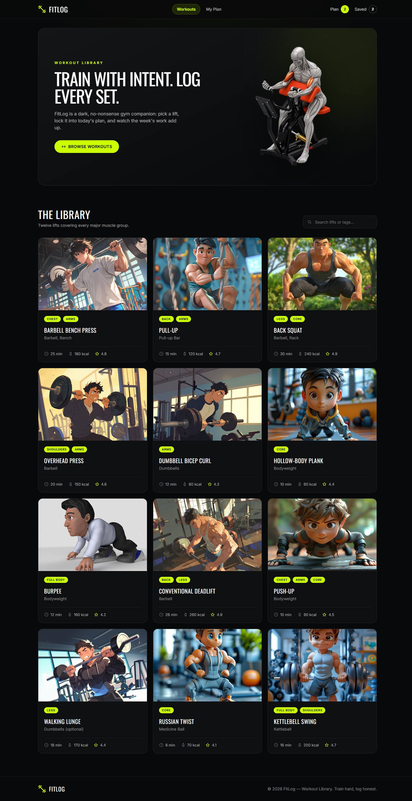
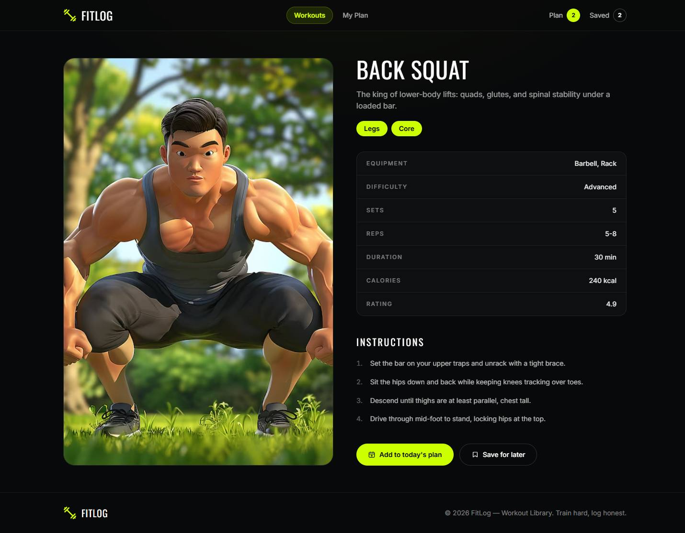
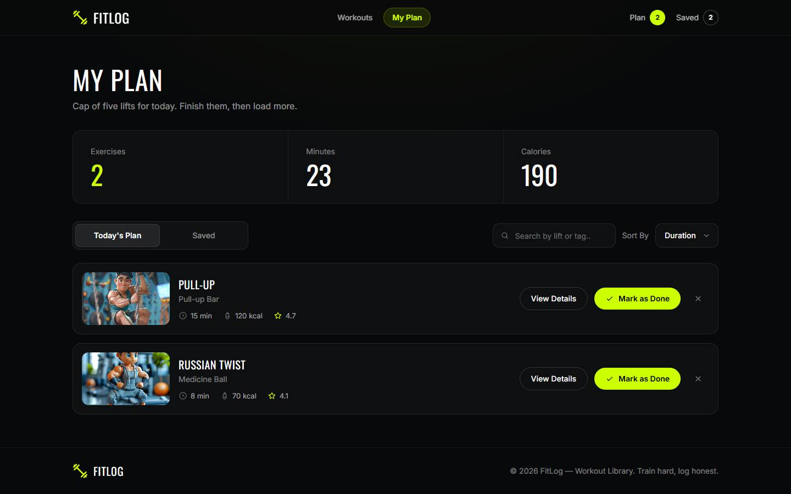

# FitLog — Workout Library

A dark, no-nonsense gym companion built with Next.js. Pick a lift from the
library, lock it into today's plan, and watch the week's work add up.

FitLog pulls twelve lifts from a live workout API, renders them as a
responsive card library, and gives every lift a detail page with its own specs
and instructions. From there you can queue a lift into **Today's Plan** (capped
at five) or stash it under **Saved** — both persisted in `localStorage`, both
counted live in the navbar.



---

## Technologies Used

| Technology | Purpose |
| --- | --- |
| **Next.js 15 (App Router)** | Routing, server components, streaming loading UI |
| **React 19** | Component model and client state |
| **TypeScript** | Typed API payloads, props and helpers |
| **Tailwind CSS 3** | The dark design system and every responsive breakpoint |
| **next/font (Oswald + Inter)** | Self-hosted display and body typography |
| **localStorage** | Persisting Today's Plan, Saved and Done across reloads |
| **Vercel** | Deployment target |

No UI kit and no icon package — the icon set, toasts, dropdown, tabs and
skeleton loaders are all built on Tailwind primitives in `src/components`.

---

## Key Features

1. **Workout library with live API data** — all twelve lifts render in a
   1 / 2 / 3 column responsive grid, each card showing its illustration,
   muscle-group pills, equipment line and the duration / calories / rating
   stat row. Cards link straight to their detail page.
2. **Today's Plan and Saved with a five-lift cap** — the detail page buttons
   write into the two My Plan lists, bump the navbar counters instantly and
   fire a toast. "Add to today's plan" disables itself once the plan holds five
   lifts, or once the lift is already queued.
3. **Live plan metrics** — the My Plan summary row starts at zero and recounts
   exercises, total minutes and total calories on every add or remove.
4. **Persistence across reloads** — the plan, the saved list and the done ticks
   are mirrored into `localStorage`, so a refresh (or a redeploy) never loses
   the day's work.
5. **Sorting, search and mark-as-done** — re-sort the current list by duration,
   calories or rating, filter by lift name or muscle group, and tick a lift off
   with the check button (which toasts and restyles the row).
6. **Loading, empty and error states everywhere** — a streamed skeleton while
   the library loads, "Loading workouts…" on My Plan, the `NOTHING HERE YET`
   empty state with its CTA, a branded 404 for invalid routes, and a retry
   action if the API is unreachable.

### More screens

| Workout details | My Plan |
| --- | --- |
|  |  |

---

## Getting Started

```bash
# install dependencies
npm install

# run the dev server on http://localhost:3000
npm run dev
```

Other scripts:

```bash
npm run build   # production build
npm run start   # serve the production build
```

### API

Workout data comes from the provided FitLog API:

- All lifts — `https://api.abcz.workers.dev/api/fitlog`
- Single lift — `https://api.abcz.workers.dev/api/fitlog/:id`

`src/lib/api.ts` automatically fails over to the alternative mirror
(`https://api.api-store.workers.dev/api/fitlog`) if the primary host does not
respond, and every request is `no-store` so workout data is always live.

---

## Deploying

The project deploys to Vercel with zero configuration — no environment
variables are required, because the API hosts are baked into
`src/lib/api.ts`.

1. Go to [vercel.com/new](https://vercel.com/new) and import this GitHub
   repository.
2. Keep the detected settings (Framework: **Next.js**, build `next build`) and
   press **Deploy**.
3. Every later push to `main` redeploys automatically.

`/` and `/workouts/[id]` are server-rendered on demand, so a hard refresh of
any route — including a deep link straight to a workout — works without a
server round-trip getting confused.

---

## Project Structure

```
assets/                     brand assets (logo, hero, illustrations)
UI/                         the Figma page references this build follows
src/
  app/
    layout.tsx              shell: fonts, navbar, footer, providers
    page.tsx                home — hero + library (server component)
    loading.tsx             streamed skeleton for the library
    my-plan/page.tsx        the log page
    workouts/[id]/          detail route + its loading skeleton
    not-found.tsx           404
    error.tsx               route error boundary
  components/               navbar, footer, hero, cards, detail + plan views
    ui/                     buttons-free primitives: pills, stats, toast, …
  context/FitLogContext.tsx plan / saved / done state + localStorage
  lib/                      API client, types and pure helpers
```

---

## Design Notes

Every page follows the supplied Figma references: near-black surfaces, a single
`#ccff00` accent, Oswald for uppercase display type and Inter for body copy.
The layout is verified at mobile (390px), tablet (820px) and desktop (1440px)
widths, with no horizontal overflow at any of them.
